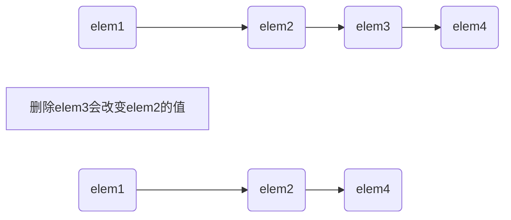

2022.11.15


## 9.3.4 特殊的forward_list操作
为了理解forward_list为什么有特殊版本的添加和删除操作，考虑当我们从一个单向列表中删除一个元素时会发生什么。如图9.1所示，删除一个元素会改变序列中的链接。在此情况下，删除elem3会改变elem2，elem2原来纸箱elem3，但删除elem3后，elem2指向了elem4。



当添加或删除一个元素时，删除或添加的元素之前的那个元素的后继会发生改变。为了添加或删除一个元素，我们需要访问其前驱，一遍改变前驱的链接。但是,forward_list是单向链表。在一个单向链表中，没有简单的方法来获取一个元素的前驱。出于这个原因，在一个froward_list中添加或删除元素的操作是通过改变给定元素之后的元素来完成的。这样，我们总是可以访问到被添加或删除操作所影响的元素。

由于这些操作于其他容器上的操作的实现方式不同，forward_list并未定义insert、emplace和erase，而是定义了名为insert_after、emplace_after和erase_after的操作(参见表9.8)。例如，在我们的例子中，为了删除elem3，应该用指向elem2的迭代器调用erase_after。为了支持这些操作，forward_list也定义了before_begin，它返回一个首前迭代器。这个迭代器允许我们在链表首元素之前并不存在的元素"之后"添加或删除元素(亦即在链表首元素之前添加删除元素)。

| **表9.8: 在forward_list中插入或删除元素的操作** |  |
|:- |:- |
| lst.before_begin() | 返回指向链表首元素之前不存在的元素的迭代器。此迭代器不能解引用 |
| lst.cbefore_begin() | 返回一个const_iterator |
| lst.insert_after(p, t) | 在迭代器p之后的位置插入元素。t是一个对象 |
| lst.insert_after(p, n, t) | n是数量 |
| lst.insert_after(p, b ,e) | b和e是表示范围的一对迭代器(b和e不能指向lst内) |
| lst.insert_after(p, il) | il是一个花括号列表，返回一个指向最后一个插入元素的迭代器。如果范围为空，则返回p。若p为尾后迭代器，则函数行为未定义 |
| emplace_after(p, args) | 使用args在p指定的位置之后创建一个元素。返回一个指向这个新元素的迭代器。若p为尾后迭代器，则函数行为未定义 |
| lst.erase_after(p) | 删除p指向的位置之后的元素，如果p指向lst的尾元素或是一个尾后迭代器，则函数行为未定义 |
| lst.erase_after(b, e) | 删除从b直到(但不包含)e之间的元素。返回一个指向被删元素之后元素的迭代器，若不存在这样的元素，则返回尾后迭代器 |

当在forward_list中添加或删除元素时，我们必须关注两个迭代器，一个指向我们要处理的元素，另一个指向其前驱。例如，可以改写从list中删除基数元素的循环程序，将其改为从forward_list中删除元素：

```c++
forward_list<int> flst = {0, 1, 2, 3, 4, 5, 6, 7, 8, 9};
auto prev = flst.before_begin();  // 表示flst的"首前元素"
auto curr = flst.begin();  // 表示flst中的第一个元素
while (curr != flst.end()) {
    if (*curr % 2) {
        curr = flst.erase_after(prev);
    } else {
        prev = curr;
        curr++;
    }
}
```

此例中，curr表示我们要处理的元素，prev表示curr的前驱。调用begin来初始化curr，这样第一步循环就会检查第一个元素是否是奇数。我们用before_begin()来初始化prev，它返回指向curr之前不存在的元素的迭代器。当找到奇数元素后，我们将prev传递给erase_after。此调用prev之后的元素删除，即删除curr指向的元素。然后我们将curr重置为erase_after的返回值，使得curr指向序列中下一个元素，prev保持不变，仍指向(新curr)之前的元素。如果curr指向的不是奇数，在else中我们将两个迭代器都向前移动。